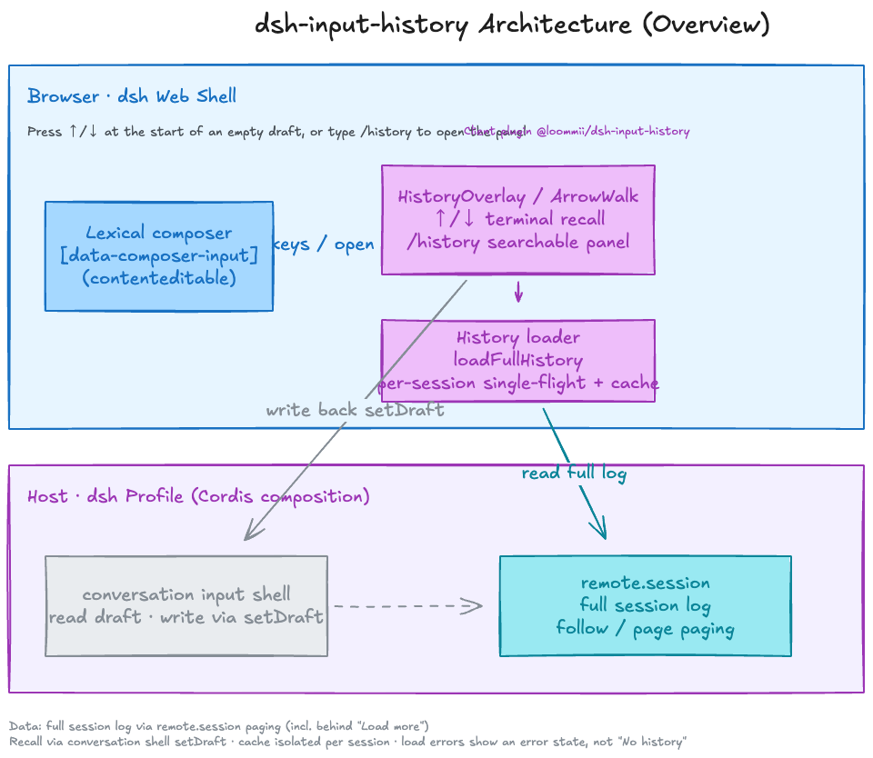

<h1 align="center">dsh-input-history</h1>

<p align="center">
  <a href="README.md">简体中文</a> · <strong>English</strong>
</p>

<p align="center">
  <a href="https://github.com/topics/dsh-plugin"></a>
  <a href="https://opensource.org/licenses/MIT"></a>
  <a href="https://www.npmjs.com/package/@deepseek-ai/dsh"></a>
</p>

<p align="center">
  <strong>Terminal-style input history: press <kbd>↑</kbd>/<kbd>↓</kbd> to browse messages sent in the current session.</strong><br>
  Pure client-side plugin, no host changes — the <code>/history</code> command opens a searchable history panel.
</p>

## 🎬 Demo

<p align="center">
  
</p>

## ✨ Features

The plugin injects two complementary recall channels into every session:

- **⌨️ Terminal-style arrow recall** — like shell history, with **no popup list**: <kbd>↑</kbd>/<kbd>↓</kbd> directly replace the composer content
- **📋 `/history` panel** — a searchable floating list, browsable with mouse or keyboard

### ⌨️ Arrow-key recall

| Action | Effect |
|---|---|
| <kbd>↑</kbd> / <kbd>↓</kbd> (empty composer, or caret at the very start) | Starts recall; fetches the most recent sent message |
| <kbd>Esc</kbd> | Restores the draft and exits recall |

### 📋 `/history` panel

| Way | Recall semantics |
|---|---|
| Pick `/history` in the slash menu | **Insert mode**: the message is inserted at the `/history` token, keeping surrounding text |

The panel supports **search filtering**, mouse clicking, and <kbd>↑</kbd>/<kbd>↓</kbd> + <kbd>Enter</kbd>; <kbd>Esc</kbd> or clicking outside cancels.

> History is read from the current session's full log (paged), strictly isolated per session; adjacent duplicate messages are collapsed automatically.

## 🚀 Install
From NPM:
```
dsh plugin --profile web add @loommii/dsh-input-history@latest
```

Or from GitHub:

```
dsh plugin --profile web add github:loommii/dsh-input-history
```

Restart the profile after installing (`dsh web` / `dsh --profile <name>`).

Upgrade / uninstall:

```
dsh plugin --profile web update @loommii/dsh-input-history
dsh plugin --profile web remove @loommii/dsh-input-history
```

## 💡 Usage

Focus the chat composer of any session:

- With an **empty composer**, press <kbd>↑</kbd>/<kbd>↓</kbd>, or move the caret to the **very start** and press <kbd>↑</kbd>: terminal-style recall begins.
- Type <code>/history</code> and pick it in the slash menu, or press Enter on the bare command: the history panel opens.

## 🏗️ Architecture

The plugin is pure client-side UI: history is paged from the host's `remote.session` full session log (cache isolated per session), and recall is written back through the `conversation` input shell's `setDraft`.

<p align="center">
  
</p>

## 📄 License

MIT
