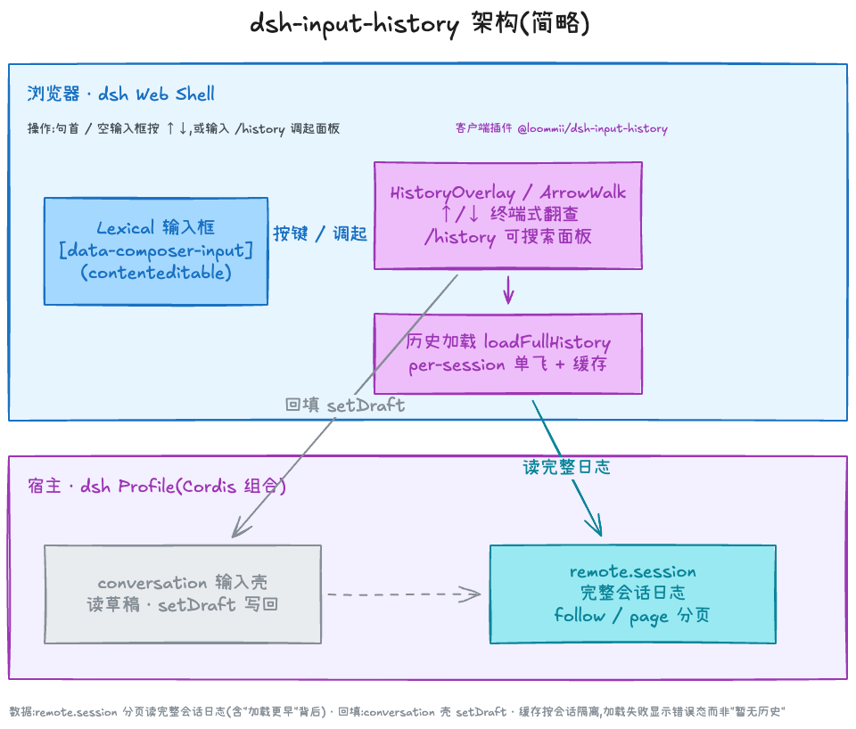

<h1 align="center">dsh-input-history</h1>

<p align="center">
  <strong>简体中文</strong> · <a href="README.en.md">English</a>
</p>

<p align="center">
  <a href="https://github.com/topics/dsh-plugin"></a>
  <a href="https://opensource.org/licenses/MIT"></a>
  <a href="https://www.npmjs.com/package/@deepseek-ai/dsh"></a>
</p>

<p align="center">
  <strong>终端式输入历史，用 <kbd>↑</kbd>/<kbd>↓</kbd> 翻查本会话发过的消息。</strong><br>
  纯客户端插件，无宿主侧改动 — <code>/history</code> 指令提供可搜索的历史面板。
</p>

## 🎬 演示

<p align="center">
  
</p>

## ✨ 功能

本插件给每个会话注入两条互补的输入历史召回通道：

- **⌨️ 终端式方向键翻查** — 仿 shell 命令历史，**不弹列表**，<kbd>↑</kbd>/<kbd>↓</kbd> 直接替换输入框内容
- **📋 `/history` 历史面板** — 可搜索的悬浮列表，支持鼠标点选与键盘操作

### ⌨️ 方向键翻查

| 操作 | 效果 |
|---|---|
| <kbd>↑</kbd> / <kbd>↓</kbd>（空输入框或光标在最前） | 开始翻查，取回最近一条已发送消息 |
| <kbd>Esc</kbd> | 还原草稿并退出翻查 |

### 📋 `/history` 面板

| 方式 | 召回语义 |
|---|---|
| 斜杠菜单选中 `/history` | **插入模式**：消息插入到 `/history` 词元位置，前后文保留 |

面板支持**搜索过滤**、鼠标点选与 <kbd>↑</kbd>/<kbd>↓</kbd> + <kbd>Enter</kbd> 操作；<kbd>Esc</kbd> 或点击面板外取消。

> 数据读取自当前会话的完整日志（含分页），按会话严格隔离；相邻重复消息自动折叠。

## 🚀 安装
从 NPM 安装：
```
dsh plugin --profile web add @loommii/dsh-input-history@latest
```

或从 GitHub 安装：

```
dsh plugin --profile web add github:loommii/dsh-input-history
```

安装后重启 profile（`dsh web` / `dsh --profile <name>`）。

升级 / 卸载：

```
dsh plugin --profile web update @loommii/dsh-input-history
dsh plugin --profile web remove @loommii/dsh-input-history
```

## 💡 使用

聚焦任意会话的聊天输入框：

- **空输入框**按 <kbd>↑</kbd>/<kbd>↓</kbd>，或光标移到**最前**按 <kbd>↑</kbd>：开始终端式翻查。
- 输入 <code>/history</code> 并从斜杠菜单选中，或直接回车：打开历史面板。


## 🏗️ 架构

本插件是纯客户端 UI：历史从宿主 `remote.session` 完整会话日志分页读取（按会话隔离缓存），回填走 `conversation` 输入壳的 `setDraft`。

<p align="center">
  
</p>


## 📄 许可

MIT
